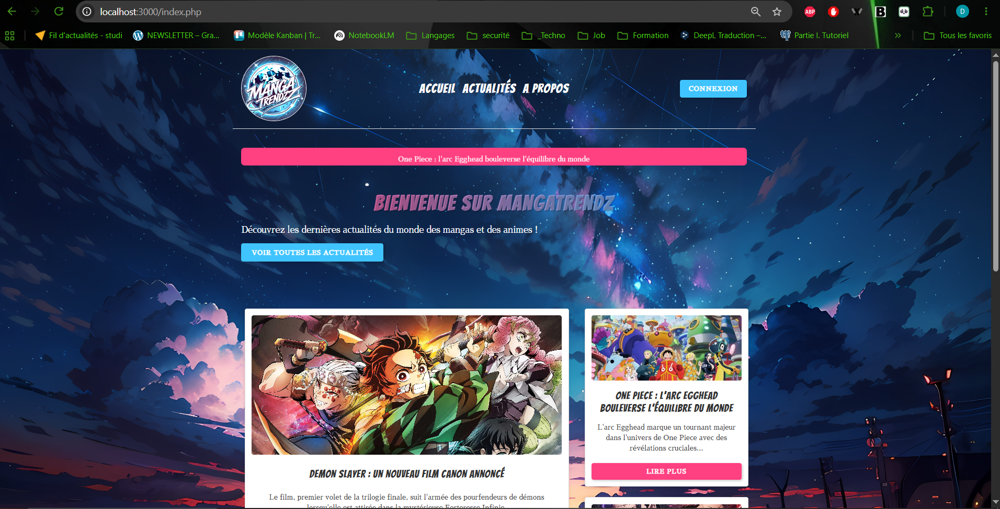
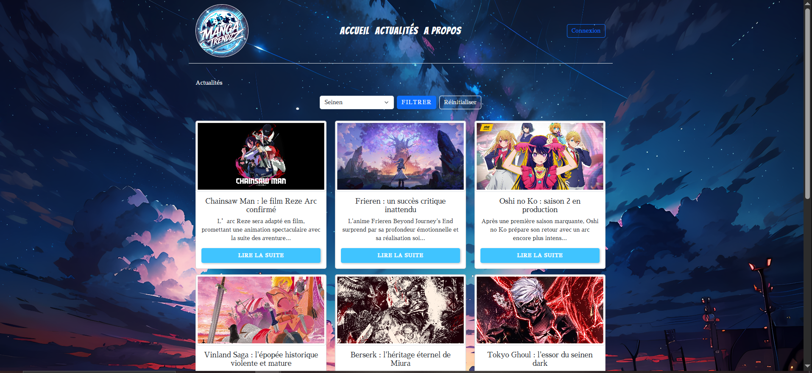
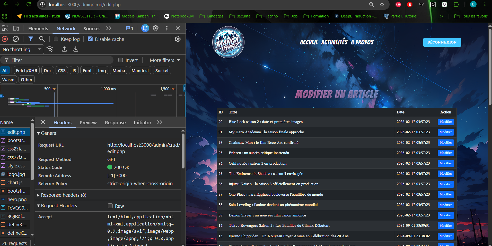
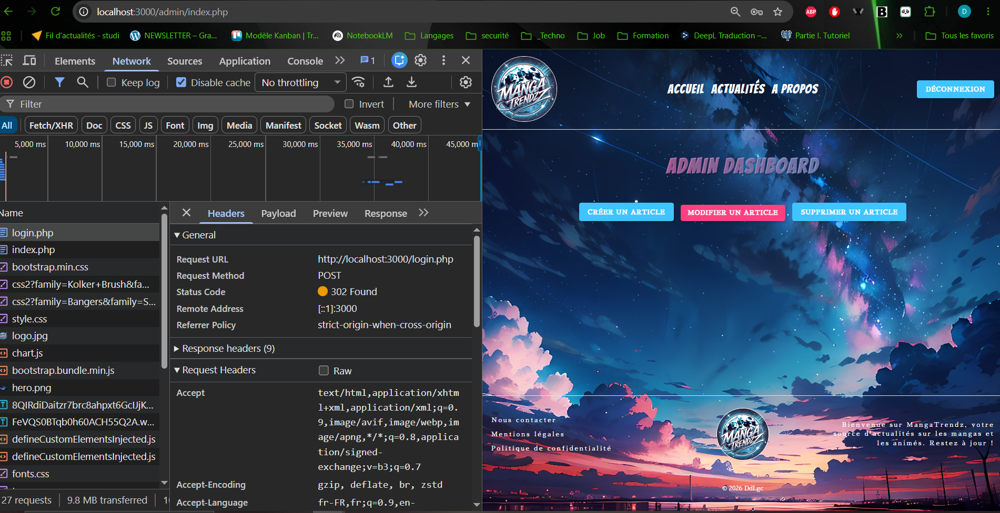

# MangaTrendz

[]()
[]()
[]()
[]()
[]()
[]()

## Description

**MangaTrendz** est un site d'actualités consacré à l'univers du manga et de l'animation japonaise.

Le projet a été développé en **PHP natif** autour d'une architecture modulaire et d'une base de données *MySQL* accessible avec **PDO**.

Il propose une partie publique permettant de consulter les actualités ainsi qu'un **back-office administrateur** permettant de gérer intégralement les articles.

Ce projet m'a notamment permis de travailler sur des problématiques différentes de mes applications plus récentes : développement PHP sans framework, gestion manuelle des sessions, accès aux données avec PDO, pagination, upload de fichiers et conception d'un CRUD complet.

---

## Fonctionnalités

### Partie publique

- Consultation des dernières actualités
- Liste complète des articles
- Affichage détaillé d'un article
- Pagination des contenus
- Organisation et filtrage des actualités
- Métadonnées SEO dynamiques
- Page 404 personnalisée
- Pages d'informations légales
- Formulaire de contact
- Interface responsive

### Authentification

- Formulaire de connexion
- Vérification des identifiants en base de données
- Mots de passe sécurisés avec *hash*
- Gestion des sessions PHP
- Gestion des rôles `user` et `admin`
- Protection des pages réservées à l'administration
- Déconnexion utilisateur

### Administration

Le back-office permet à l'administrateur de gérer les contenus publiés sur MangaTrendz.

Fonctionnalités disponibles :

- Tableau de bord administrateur
- Création d'articles
- Modification d'articles
- Suppression d'articles
- Upload d'images
- Utilisation d'une image par défaut
- Suppression des fichiers associés
- Pagination de l'administration
- Messages de confirmation
- Contrôle d'accès selon le rôle utilisateur

---

## Stack technique

### Frontend

- **HTML5**
- **CSS3**
- **Bootstrap 5**
- **JavaScript**
- **Google Fonts**

### Backend

- **PHP 8+**
- **MySQL**
- **PDO**
- Sessions PHP
- Authentification avec `password_verify()`

### Outils

- Git
- GitHub
- Visual Studio Code
- WAMP
- phpMyAdmin

---

## Architecture

MangaTrendz utilise une organisation PHP modulaire séparant les différentes responsabilités de l'application.

```text
MangaTrendz/
├── admin/
│   ├── crud/
│   │   ├── create.php
│   │   ├── delete.php
│   │   ├── edit.php
│   │   └── edit_article.php
│   ├── templates/
│   ├── articles.php
│   ├── index.php
│   └── sessionAdmin.php
│
├── assets/
│   ├── img/
│   ├── uploads/
│   │   └── articles/
│   └── style.css
│
├── lib/
│   ├── article.php
│   ├── config.php
│   ├── menu.php
│   ├── pdo.php
│   ├── session.php
│   ├── start_session.php
│   └── user.php
│
├── templates/
│   ├── article_part.php
│   ├── footer.php
│   └── header.php
│
├── z-Documentation/
│   ├── Blog-Théorie.pdf
│   └── manga-trendz.sql
│
├── 404.php
├── a_propos.php
├── actualite.php
├── actualites.php
├── contact.php
├── index.php
├── legal_information.php
├── login.php
├── logout.php
└── pdc.php
```

---

## Accès aux données

L'accès à la base de données est réalisé avec **PDO**.

Les requêtes préparées permettent notamment :

- de récupérer les articles ;
- de gérer leur pagination ;
- d'authentifier les utilisateurs ;
- de créer, modifier et supprimer les contenus.

L'utilisation de requêtes préparées limite également les risques liés aux injections SQL.

---

## Authentification et autorisations

Lors de la connexion, MangaTrendz recherche l'utilisateur à partir de son adresse e-mail.

Le mot de passe fourni est comparé au mot de passe hashé enregistré en base de données avec :

```php
password_verify()
```

Après authentification, l'identifiant et le rôle de l'utilisateur sont conservés dans la session PHP.

Les pages d'administration vérifient ensuite que l'utilisateur possède le rôle :

```text
admin
```

avant d'autoriser l'accès aux fonctionnalités du back-office.

---

## Installation

### Prérequis

- PHP **8 ou supérieur**
- MySQL
- Apache
- Git
- WAMP, XAMPP ou environnement équivalent

---

### 1. Cloner le projet

```bash
git clone https://github.com/DdLgc/Blog-MangaTrendz.git
```

Puis :

```bash
cd Blog-MangaTrendz
```

Dans une installation WAMP locale, le projet peut par exemple être placé dans :

```text
C:\wamp64\www\MangaTrendz
```

---

### 2. Créer la base de données

Le dump SQL nécessaire au projet se trouve dans :

```text
z-Documentation/manga-trendz.sql
```

Créer une base MySQL puis importer ce fichier.

---

### 3. Configurer la connexion

Les paramètres de connexion sont définis dans :

```text
lib/config.php
```

Adapter si nécessaire :

```php
define("_DB_SERVER_", "localhost");
define("_DB_NAME_", "...");
define("_DB_USER_", "...");
define("_DB_PASSWORD_", "");
```

---

### 4. Configurer l'URL de base

Pour une exécution avec le serveur PHP à la racine du projet :

```php
define("_BASE_URL_", "/");
```

---

### 5. Lancer l'application

Depuis la racine du projet :

```bash
php -S localhost:3000
```

Puis ouvrir :

```text
http://localhost:3000/
```

Avec WAMP/Apache, l'URL dépendra du dossier ou du VirtualHost configuré.

---

## Compte administrateur de démonstration

Le dump SQL fourni avec le projet contient un compte administrateur permettant de tester le back-office.

| Rôle | E-mail | Mot de passe |
| --- | --- | --- |
| Administrateur | `admin@test.com` | `test` |

> Ces identifiants sont destinés uniquement à l'environnement local et à la démonstration du projet.

Une fois connecté, l'administrateur peut accéder au tableau de bord et aux fonctionnalités CRUD des articles.

---

## Gestion des images

Lors de la création ou de la modification d'un article, l'application permet d'associer une image au contenu.

Le projet gère notamment :

- l'upload d'images ;
- le stockage dans `assets/uploads/articles/` ;
- l'utilisation d'une image par défaut ;
- le remplacement d'une image ;
- la suppression du fichier associé lorsque nécessaire.

---

## Compétences mises en œuvre

Ce projet met particulièrement en évidence :

- développement backend en **PHP natif**
- accès aux données avec **PDO**
- conception et manipulation d'une base **MySQL**
- requêtes SQL préparées
- authentification et sessions PHP
- gestion des rôles et autorisations
- développement d'un **CRUD complet**
- pagination de données
- upload et gestion de fichiers
- architecture PHP modulaire
- intégration Bootstrap
- conception responsive
- SEO dynamique
- gestion des erreurs et page 404
- utilisation professionnelle de Git et GitHub

---
## Captures d'écran

### Accueil

Vue principale de **MangaTrendz**, présentant les dernières actualités et l'identité visuelle du site.



### Actualités

Consultation des articles avec *filtrage par catégorie* et système de *pagination*.



### Administration

Interface d'administration permettant la gestion dynamique du contenu et des articles.



### Authentification

Vérification de la connexion administrateur via une requête HTTP `POST` réussie dans les outils de développement du navigateur.


## Évolutions possibles

Le projet pourrait encore évoluer avec :

- migration vers une architecture MVC plus stricte ;
- utilisation d'un routeur centralisé ;
- validation plus poussée des fichiers uploadés ;
- protection CSRF des formulaires ;
- tests automatisés ;
- amélioration de l'accessibilité ;
- migration vers un framework backend comme Symfony.

Ces évolutions permettent également de mesurer le chemin parcouru entre ce projet en PHP natif et mes applications plus récentes basées sur des architectures et frameworks plus avancés.

---

## Documentation

Des documents complémentaires sont disponibles dans :

```text
z-Documentation/
```

Ils comprennent notamment :

- la documentation théorique du projet ;
- le dump SQL nécessaire à la base de données.

---

## Liens

[](https://github.com/DdLgc/Blog-MangaTrendz)

[](https://ddlgc-portfolio.netlify.app/)

[](https://www.linkedin.com/in/david-le-gouellec-551322243/)

---

## Auteur

**David Le Gouellec**

Développeur Web Full Stack

---

## Licence

Projet réalisé dans un cadre pédagogique et destiné à la présentation de compétences en développement web.